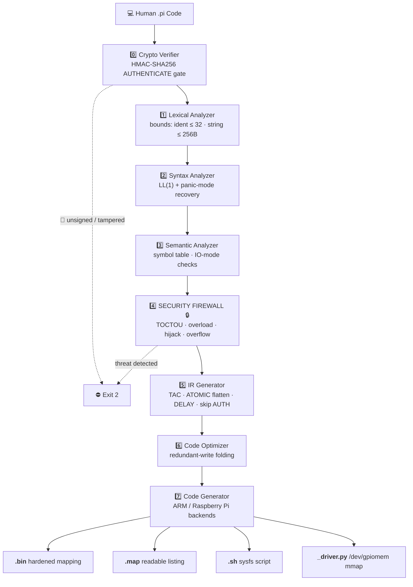
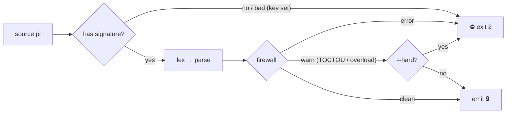

# SentryPi: A Security-First DSL & Compiler for Raspberry Pi IoT 🛡️🚀

[](https://opensource.org/licenses/MIT)
[](https://www.raspberrypi.com/)
[](#-the-security-firewall-usp)
[](https://github.com/ZeroHackOrg/SentryPi)
[](#)

SentryPi is an open-source, security-focused Domain-Specific Language (DSL) and
Compiler built from scratch. It bridges the gap between high-level,
human-friendly engineering software and low-level physical ARM hardware.

While existing frameworks (like Flask or Paho-MQTT) force beginner IoT students
to manage complex network stacks and write insecure code, SentryPi abstracts
away the boilerplate while acting as a **compile-time firewall**. It scans,
audits, and hardens your code *before a single electrical signal reaches your
physical components* — and it can even **cryptographically verify** that the
source is signed by an authorized developer.

---

## 💡 The Core Innovation

IoT devices are the weakest link in global infrastructure. Beginners
accidentally write code vulnerable to buffer overflows, and open network ports
leave hardware exposed to malicious register manipulation.

SentryPi solves this at the **compilation level** — with a 9-stage pipeline
that verifies identity and hardens code *before* synthesis:



By leveraging a custom **Static Analysis Security Pass** over the Abstract
Syntax Tree (AST), the compiler explicitly drops any compilation attempt that
contains unauthorized hardware pin access, unsanitized memory buffers,
uninterruptible race conditions, or current-overload toggles — and only then
lowers the verified AST to an optimizer-backed, hardware-targeted instruction
stream.

> 📖 Official documentation:
> **Quickstart** — [docs/QUICKSTART.md](docs/QUICKSTART.md) ·
> **Hackathon demo & pitch** — [docs/HACKATHON-DEMO.md](docs/HACKATHON-DEMO.md) ·
> **Hardware** — [docs/HARDWARE-GUIDE.md](docs/HARDWARE-GUIDE.md) ·
> **Specification** — [docs/SPEC.md](docs/SPEC.md) ·
> **Architecture** — [docs/ARCHITECTURE.md](docs/ARCHITECTURE.md) ·
> **FAQ & comparison** — [docs/FAQ.md](docs/FAQ.md) ·
> **Porting & AI** — [docs/PORTING-AND-EXTENDING.md](docs/PORTING-AND-EXTENDING.md) ·
> **Enterprise delivery** — [docs/ENTERPRISE-DELIVERY.md](docs/ENTERPRISE-DELIVERY.md)
>
> 🛡️ Security & governance: [SECURITY.md](SECURITY.md) (disclosure policy) ·
> [CONTRIBUTING.md](CONTRIBUTING.md) · [CHANGELOG.md](CHANGELOG.md) ·
> [LICENSE](LICENSE) (MIT, © ZeroHack.org).

---

## 🚀 Getting Started

### Requirements

- Python 3.9+

### Installation (editable dev install)

```bash
$ git clone https://github.com/ZeroHackOrg/SentryPi.git
$ cd sentrypi
$ pip install -e .
```

This installs the `sentryc` compiler binary. Verify it:

```bash
$ sentryc --version
sentryc 0.2.1 (SentryPi Security Compiler)
```

### Compile your first program

```bash
$ sentryc examples/blink.pi
```

Each safe compile emits **four** artifacts:

- `blink.bin` — the hardened execution mapping for the Pi GPIO controller.
- `blink.map` — a human-readable record-by-record listing (see the [map format](docs/SPEC.md)).
- `blink.sh` — a deployable `#!/bin/bash` script that writes straight to `/sys/class/gpio` (BCM numbering), with no Python/Javascript runtime.
- `blink_driver.py` — a high-speed `mmap("/dev/gpiomem")` GPIO driver for latency-critical deployments.

Every build also reports its **TAC instruction count** and **optimizer savings**
(e.g. redundant writes folded to reduce physical I/O wear).

### Quickstart & Hardware

New here? Follow [docs/QUICKSTART.md](docs/QUICKSTART.md) (zero-hardware
sandbox → first compile → signed CI gate) and [docs/HARDWARE-GUIDE.md](docs/HARDWARE-GUIDE.md).

**Required hardware** (see the full table in the guide):

| Starter kit (`blink.pi`) | Smart Home kit (`smart_home.pi`) |
| :--- | :--- |
| Raspberry Pi 4B **or** 5 · 5V/3A PSU · 16GB+ microSD · breadboard · jumpers | everything left, plus: |
| 2× LED, 2× 220 Ω resistors | PIR motion sensor (pin 23), reed/magnetic door switch (pin 24), 2× 10 kΩ pull-downs, 2nd LED (pin 22) |

**Hackathon rig (2 LEDs only):** green → BCM GPIO 18, red → BCM GPIO 23, two
220 Ω resistors. Compile `living_room.pi` (green on = appliance running) and
`device_fault.pi` (blocked by the firewall, red on = Safe-Fail lockdown).
Full pitch script, trace-by-trace demo, and the domain pitch matrix are in
[docs/HACKATHON-DEMO.md](docs/HACKATHON-DEMO.md).

Compile + deploy on the Pi:

```bash
sentryc examples/blink.pi        # emits blink.bin/.map/.sh/_driver.py
sudo bash blink.sh               # sysfs path
sudo python3 blink_driver.py     # /dev/gpiomem mmap path
```

### Language in one screen

```
statement := LINK PIN <int> TO <name> [AS OUTPUT|INPUT]  # declare hardware
           | <name> HIGH|LOW                             # assign an output (alias syntax)
           | TRIGGER <name> HIGH|LOW                     # drive an output
           | LOG <string>                                # emit a log line
           | DELAY <int> MS                              # scheduling barrier
           | IF <name> [IS] HIGH|LOW THEN ... END              # event-driven branch
           | ATOMIC ... END                              # race-free hardware block
           | AUTHENTICATE WITH "<hex>"                   # HMAC-SHA256 signature (line 1)
           | FORCE OVERRIDE <resource> WITH <string> [* <int>]   # (blocked by firewall)
```

### Run the test suite

```bash
$ python -m unittest discover -s tests -v
```

---

## 🛠️ Human-Friendly Syntax Example

Say goodbye to 30 lines of complex, multi-library Python initializations. Here
is how a beginner writes a secure automated response system in SentryPi
(`alarm.pi`):

```
# Define physical hardware boundaries safely
LINK PIN 18 TO TARGET_LED AS OUTPUT
LINK PIN 23 TO MOTION_SENSOR AS INPUT

# Event-driven secure execution inside an atomic hardware block
ATOMIC
    IF MOTION_SENSOR IS HIGH THEN
        TRIGGER TARGET_LED HIGH
        LOG "Alert: Perimeter breach mitigated safely."
    END
END
```

### Compiling and Running

The system utilizes a dedicated compilation binary engine (`sentryc`):

```
# Compile the safe source file
$ sentryc alarm.pi

# Resulting output
[SentryPi] Scanning tokens... Success.
[SentryPi] Building Abstract Syntax Tree... Success.
[SentryPi] Running Semantic Analysis... Success.
[SentryPi] Running Static Security Firewall... PASS (0 Threats Detected).
[SentryPi] Generating Intermediate Representation... 8 TAC instructions.
[SentryPi] Optimizing instruction schedule... 8 instructions (0 redundant removed).
[SentryPi] Target backend: Raspberry Pi ARM (BCM2835 / BCM2711 / RP1) (id=arm, boards=Raspberry Pi 4B, Raspberry Pi 5).
[SentryPi] Emitting hardened execution mapping... Created 'alarm.bin'
[SentryPi] Writing readable map listing... Created 'alarm.map'
[SentryPi] Synthesizing deployable sysfs script... Created 'alarm.sh'
[SentryPi] Synthesizing high-speed /dev/gpiomem driver... Created 'alarm_driver.py'
[SentryPi] Compilation complete. Safe for deployment.
```

---

## 🔒 The Security Firewall (USP)

If a malicious contributor or a student introduces a payload that risks an
overcurrent or memory injection, SentryPi stops it cold:

```
# security_test.pi (Malicious payload simulation)
LINK PIN 02 TO SYSTEM_CLOCK
FORCE OVERRIDE BUFFER WITH "A" * 5000

$ sentryc security_test.pi

[SentryPi] Running Static Security Firewall...
❌ COMPILE ERROR [Line 2]: Security Exception! System Threat Detected! Attempted hijack of Reserved Pin 02.
❌ COMPILE ERROR [Line 3]: Buffer overflow vulnerability detected! String size (5000 bytes) exceeds safe buffer allotment of 256 bytes.
⚠️  Compilation aborted. Physical hardware protected.
```

### Audit Rules (what the firewall blocks)

| Vector | Rule |
| :--- | :--- |
| 🚨 Hardware privilege escalation | `LINK` to a reserved power/ground pin (`1, 2, 4, 6, 9, 14, 20, 25, 30, 34, 39`) |
| 🚨 Invalid pin | pin outside the physical 40-pin header |
| 🚨 System component lock | `LINK` to `SYSTEM_CLOCK` / `SYSTEM_BUS` |
| 🚨 Logic manipulation | writing a payload to an `INPUT` peripheral |
| 🚨 Memory injection | `FORCE OVERRIDE` effective size > 256 bytes |
| 🚨 Lexical bounds | identifier > 32 chars, string > 256 bytes (rejected at scan) |
| 🚨 **TOCTOU race** | `IF` queries a peripheral outside an `ATOMIC` block (error under `--hard`) |
| 🚨 **Current overload** | > 20 pin toggles with no `DELAY` barrier (error under `--hard`) |



Warnings (unknown component, duplicate link/pin) are reported but never block
execution in default mode. `--hard` switches the auditor into **enterprise
strict mode**:

```
$ sentryc examples/race.pi --hard
[SentryPi] Running Static Security Firewall...
❌ COMPILE ERROR [Line 7]: Potential TOCTOU race: IF queries peripheral 'PIR' outside an atomic hardware block. Wrap it in ATOMIC ... END.
⚠️  Compilation aborted. Physical hardware protected.
```

---

## 🔐 Cryptographic Source Signing

SentryPi can require that every source be signed by an authorized developer
before it compiles. Signing uses **HMAC-SHA256** with a master key:

```mermaid
flowchart LR
    K["🔑 master key<br/>(--key or SENTRYPI_MASTER_KEY)"] --> S["sentryc sign"]
    S --> P["AUTHENTICATE WITH \"0x<digest>\"<br/>+ payload"] --> C["sentryc"]
    C --> ok["✔ Source Verified"] or bad["🚨 Signature Mismatch → exit 2"]
```

```
# sign once
$ export SENTRYPI_MASTER_KEY="0xcafebabe42424242"
$ sentryc sign alarm.pi -o signed_alarm.pi
[SentryPi] Signed with HMAC-SHA256: 0x732078172c235c422ed47f4fa9bd2a7958f6aecdbb7e3f546cdd1983541918b8
[SentryPi] AUTHENTICATE header written to 'signed_alarm.pi'.
🔒 Compile with the same key to verify source integrity.

# tampering is stopped at the gate
$ sed 's/HIGH/LOW/' signed_alarm.pi > fake.pi
$ sentryc fake.pi
[SentryPi] Cryptographic Signature Verification... FAIL.
🚨 🚨 CRITICAL WARNING: Signature Mismatch! Firmware modification or script injection attempt intercepted by ZeroHack Firewall.
```

Without a key configured, signing is skipped (developer mode), keeping the
example sources portable.

---

## 🧠 Panic-Mode Syntax Recovery

Errors never crash the pipeline. The parser records **every** syntax error in a
file, then the build aborts with the full count:

```
$ sentryc /tmp/bad.pi
[SentryPi] Scanning tokens... Success.
[SentryPi] Building Abstract Syntax Tree... FAIL.
❌ SYNTAX ERROR [Line 2]: Expected one of HIGH, LOW but found 1.
⚠️  Compilation aborted. 1 syntax error discovered (panic-mode recovery).
          (exit code 1)
```

---

## ⚡ High-Speed `/dev/gpiomem` Backend

The `_driver.py` artifact maps the BCM GPIO peripheral registers straight into
Python via `mmap`, skipping sysfs for low-latency designs:

```
GPIO window  (mmap /dev/gpiomem, 4096 B, O_SYNC)
├── GPFSEL  0x00  → set_pin_mode(pin, mode)
├── GPSET   0x1C  → write_pin(pin, 1)
├── GPCLR   0x28  → write_pin(pin, 0)
└── GPLEV   0x34  → read_pin(pin)
```

Physical pins are mapped to BCM GPIO through `PHYSICAL_TO_BCM`
(e.g. physical 18 → BCM 24). `FORCE OVERRIDE` is never synthesized in any
backend.

---

## 🧪 Developer Manual

### CLI Reference

```
usage: sentryc [-h] [-o OUTPUT_DIR] [--no-bin] [--no-map] [--no-sh]
               [--no-driver] [--hard] [--key KEY] [--version] source

subcommands:
  sentryc sign <source> [-o OUTPUT] [--key KEY]   attach HMAC signature
  sentryc serve [--host HOST] [--port PORT]        localhost web playground

environment:
  SENTRYPI_MASTER_KEY    master signing key (hex or passphrase)
  SENTRYPI_TARGET        backend target id (default: arm; see registry below)

exit codes:
  0  compiled successfully
  1  lexical / syntax / I/O error (threat vector rejected at scan)
  2  blocked by Security Firewall or cryptographic verification failure
```

| Flag | Effect |
| :--- | :--- |
| `-o DIR` | output directory for artifacts |
| `--no-bin` / `--no-map` / `--no-sh` / `--no-driver` | skip individual artifacts |
| `--hard` | escalate TOCTOU/overload warnings into errors |
| `--key <hex\|passphrase>` | master signing key (overrides env) |

### Backend registry

Hardware code generation is pluggable through an in-process registry
(`src/sentrypi/targets.py`). Backends declare which artifacts they can emit
(`.bin` / `.map` / `.sh` / `<name>_driver.py`) and are selected with
`SENTRYPI_TARGET`:

```bash
SENTRYPI_TARGET=arm sentryc examples/alarm.pi -o build   # Raspberry Pi (default)
```

The default `arm` target targets BCM2835 / BCM2711 / RP1. Third-party and
enterprise backends (ESP32, STM32, Arduino, LLVM) register a `Target` with
`targets.register(...)` before invoking the compiler — no pipeline changes
required (see `docs/PORTING-AND-EXTENDING.md` and
`docs/ENTERPRISE-DELIVERY.md`).

### Web Playground

`sentryc serve` starts a localhost editor that runs the full pipeline in a
browser and streams back identical `sentryc` output — a great teaching tool and
a demo centerpiece (containerize it in production).

### Development workflow

```bash
python3 -m venv venv && source venv/bin/activate && pip install -e .

python -m unittest discover -s tests -v     # 92 passing tests
sentryc examples/alarm.pi                   # full pipeline smoke test
sentryc examples/race.pi --hard             # firewall strict-mode check
```

---

## 🧩 Expand, Integrate & Go AI

SentryPi is built for growth — the backend is a **registry**, so new hardware
targets plug in without touching the pipeline.

- **Support other IoT frameworks** (ESP32, STM32, Arduino): implement the four
  `Target` hooks, `targets.register(...)`, then
  `SENTRYPI_TARGET=esp32 sentryc app.pi`. The firewall + crypto + optimizer run
  before any backend, so every port inherits full security.
- **Add DSL statements:** grow the language with one AST node, one parser
  handler, optional firewall rule, and codegen — exact recipe in
  [docs/PORTING-AND-EXTENDING.md](docs/PORTING-AND-EXTENDING.md).
- **Integrate frameworks** (MQTT, Home Assistant, Node-RED): every generated
  driver exposes one stable ABI — `set_pin_mode`, `read_pin`, `write_pin`.
- **Smart Home full-power kit:** `examples/smart_home.pi` is a complete
  multi-output, atomic, sensor-driven build you can compile today.
- **On-device AI:** feed `read_pin()` telemetry into a TensorFlow Lite model
  and actuate through `write_pin()` — see the AI guide for the SDK.

Full-power unlock tiers (Community / Enterprise SDK / Custom Integration) and
the AI/DSL roadmap are documented in
[docs/PORTING-AND-EXTENDING.md](docs/PORTING-AND-EXTENDING.md).

---

## 🔐 Enterprise Confidentiality & Ownership

SentryPi follows a strict **open-core model**. The MIT repo is complete and
cloneable *by design*; the enterprise value lives in the licensed layer —
see [docs/ENTERPRISE-DELIVERY.md](docs/ENTERPRISE-DELIVERY.md) for the full
confidentiality and ownership strategy:

- **No hidden code in the public repo** — a clone gets a fully working
  open-core compiler and nothing more.
- **Proprietary surface is licensed**: ESP32/STM32/Arduino backends, native ARM
  codegen, asymmetric (Ed25519) signing, compliance packs, AI engines, per-
  device key binding / secure boot integration.
- **Everything compiled is signed**: `sentryc sign` → HMAC gate at stage 0,
  signed artifact chain from CI to device, key material never committed.
- **Trademarks + CLA**: "SentryPi"/"ZeroHack" marks and contributor license
  agreements keep the commercial boundary clear.
- **License enforcement**: signed license files bound to customer machines,
  offline-capable, no phone-home.

> ⚠️ Honest engineering note: security-by-hiding is rejected. We protect
> *licensed value* and *signed artifacts*, not Python obfuscation.

---

## 🗺️ The Landscape: Who Else Is Doing This?

You are tapping into an elite and rapidly growing paradigm called **Secure
Compilation and Language-Based Security**. Globally, researchers and corporate
labs are shifting security away from reactive firewalls and moving it directly
into the development cycle. [1, 2, 3]

A comprehensive look at the ecosystem shows who you are competing with or
building upon:

1. **Academic Researchers**: Over 90+ peer-reviewed papers published recently
   focus entirely on using static analysis to find IoT vulnerabilities (like
   unsafe `strcpy` or buffer limits). Research teams at institutions like
   [SIGPLAN](https://blog.sigplan.org/2019/07/01/secure-compilation/) track
   "Secure Compilation Chains" to enforce type safety and memory boundaries for
   low-level execution. [1, 2]

2. **Enterprise Systems Vendors**: Tech giants and semiconductor firms (like
   Silicon Labs' CPMS platform) are forcing security features like secure boot
   and flash protection right into the chip-level provisioning phase. [4]

3. **The Industry Gap**: Most existing enterprise tools target advanced
   firmware emulation or binary extraction (like PANDA, FirmWire, or FACT).
   They analyze code *after* it is already written. [5, 6]

## 🛡️ What SentryPi Brings to Bridge the Gap

This is our core product differentiator. Most IoT devices fail because of
complex frameworks and poor input validation. [1, 7]

| | The Status Quo | The SentryPi Framework |
|---|---|---|
| Workflow | Write complex Python, Flask, or C, then buy a secondary tool (like a SAST scanner) to find bugs | Development and security are unified in one tool |
| Supply chain | No source of truth for "who wrote this" | Mandatory HMAC-SHA256 developer signatures |
| Input handling | Manual sanitization, easy to get wrong | Native input sanitization, register locks, and pointer analysis |
| Failure mode | Insecure script ships, bugs found later | The compiler structurally rejects or refuses to emit the executable |

A developer **cannot** accidentally write an insecure script because the
compiler structurally changes forms or refuses to emit the executable. [1, 5, 8]

---

## 📂 Repository Architecture

```
sentrypi/
├── .github/workflows/ci.yml # CI: tests + compiles + signing gate + hard mode
├── docs/
│   ├── QUICKSTART.md         # Software bring-up (zero-hardware → Pi)
│   ├── HACKATHON-DEMO.md     # 3-min oral pitch, LED rig, demo traces, pitch matrix
│   ├── HARDWARE-GUIDE.md     # Parts lists, wiring, deployment
│   ├── ARCHITECTURE.md       # Full engine spec: pipeline, crypto, IR, drivers
│   ├── SPEC.md               # Grammar, security policy & binary format spec
│   ├── FAQ.md                # Technical FAQ + industry comparison matrix
│   ├── PORTING-AND-EXTENDING.md  # ESP32/STM32/Arduino ports + AI integration
│   └── ENTERPRISE-DELIVERY.md    # Confidentiality, ownership, licensing
├── examples/
│   ├── blink.pi             # Safe hardware init + DELAY barrier
│   ├── sensor.pi            # ATOMIC polling hardware inputs
│   ├── alarm.pi             # Event-driven motion alarm (atomic)
│   ├── deploy.pi            # Alias syntax + atomic conditional deployment
│   ├── smart_home.pi        # Full Smart Home kit (multi-output, atomic, AI-ready)
│   ├── living_room.pi       # Healthy smart-home trace (clean compile, demo)
│   ├── device_fault.pi      # Corrupted-stream trace (Safe-Fail: blocked, exit 2)
│   ├── hackathon_demo.py    # Two-trace table driver (real pipeline + LED rig)
│   ├── race.pi              # TOCTOU hazard demo (warns; --hard rejects)
│   ├── strobe.pi            # Overload hazard demo (warns; --hard rejects)
│   └── security_test.pi     # Simulated security failure vector
├── src/sentrypi/
│   ├── ast_nodes.py         # AST node definitions
│   ├── lexer.py             # Lexical analyzer + input buffer boundary rules
│   ├── parser.py            # LL(1) parser w/ panic-mode recovery
│   ├── semantic_analyzer.py # Symbol table, IO-mode & type enforcement
│   ├── static_analyzer.py   # 🔒 The Security Firewall (TOCTOU, overload)
│   ├── crypto.py            # HMAC-SHA256 signature verifier + signer
│   ├── ir.py                # Three-Address Code (TAC) generator
│   ├── optimizer.py         # Redundant-write folding + barrier reset
│   ├── target_arm.py        # Code Gen: .bin/.map/.sh + /dev/gpiomem driver
│   ├── targets.py           # Backend registry (plug in ESP32/STM32/AI)
│   ├── compiler.py          # Pipeline orchestration
│   ├── cli.py               # sentryc binary entry point
│   └── playground.py        # Localhost web editor (sentryc serve)
├── SECURITY.md              # Vulnerability disclosure & threat model
├── CONTRIBUTING.md          # Contributor guide
├── CHANGELOG.md             # 0.1.0 → 0.2.0 release history
├── LICENSE                  # MIT (© ZeroHack.org)
└── tests/                   # 92 test cases covering the full pipeline
```

---

## 💼 Positioning as a Product

A strategy to transition SentryPi from a student project into a commercial
vehicle that wins enterprise clients or builds prestige for your cybersecurity
company, **ZeroHack.org**:

```
[ Free Open-Source Core ] ──> [ Enterprise Security Audits ] ──> [ B2B Enterprise Licensing ]
  (Builds Massive Trust)         (Powered by ZeroHack.org)         (Hardened Commercial SDKs)
```

1. **The Open-Source "Hook" (Freemium Model)** — Keep the Raspberry Pi compiler
   core 100% open-source on GitHub at
   [ZeroHackOrg/SentryPi](https://github.com/ZeroHackOrg/SentryPi). This acts
   as a massive marketing funnel. When engineers, hardware makers, and tech
   students use it, it immediately highlights ZeroHack.org as an authority in
   low-level systems defense.

2. **The Enterprise Product Shift: "Sentry-SDK for Microcontrollers"** —
   Consider this project the MVP (Minimum Viable Product). For potential
   enterprise buyers, pitch a commercial closed-source layer:
   **Sentry-Enterprise**. Instead of targeting just a Raspberry Pi, market it
   as an automated pipeline plugin that allows manufacturers to compile secure,
   exploit-proof code directly onto medical devices, smart vehicles, and
   industrial sensors. [9]

3. **The B2B Pitch to Attract Corporate Buyers**

   > "The global IoT security market is surging toward $53.3 Billion in 2026,
   > driven heavily by new legislation like the EU Cyber Resilience Act, which
   > mandates documented security-by-design. Most companies fail compliance
   > because their engineers lack specialized cyber-talent. At ZeroHack.org, we
   > developed SentryPi to eliminate human error. By shifting security directly
   > into the compiler AST phase, we block memory injection, unauthorized
   > register access, and unverified supply-chain code at the source. We
   > license our compiler frameworks to hardware teams to guarantee hardware
   > protection and automated regulatory compliance before manufacturing."
   > [8, 10, 11, 12]

4. **Turn GitHub Stars into Consulting Revenue**

   > "Need to secure your legacy embedded systems? SentryPi is maintained by
   > ZeroHack.org. We provide full-scope firmware reverse-engineering, hardware
   > penetration testing, and secure-compiler integration for modern
   > enterprises." [6, 8]

### B2B Commercial Inquiries & Consulting

`SentryPi` is engineered by **[ZeroHack.org](https://zerohack.org)** to
demonstrate secure product design at the compilation level.

- **Looking for security solutions?** We license custom, enterprise-grade
  compilation layers to hardware manufacturers, medical device developers, and
  automotive firmware vendors.
- **Need an audit?** Your team can commission advanced firmware penetration
  testing, architectural vulnerability reviews, or secure development
  pipelines.

**Contact Core Systems Architect:** [solutions@zerohack.org](mailto:solutions@zerohack.org) ·
**Digital Defense Lab:** [ZeroHack.org](https://zerohack.org)

---

## 🤝 For Contributors

We welcome contributions from systems engineers, cybersecurity researchers, and
compiler enthusiasts!

### Development Environment Setup

1. **Clone the infrastructure repo:**

   ```bash
   git clone https://github.com/ZeroHackOrg/SentryPi.git
   cd sentrypi
   ```

2. **Initialize the local validation suite:**

   ```bash
   python3 -m venv venv
   source venv/bin/activate
   pip install -e .
   ```

3. **Execute compiler diagnostics:**

   ```bash
   python -m unittest discover -s tests -v
   # or equivalently
   pytest tests/
   ```

### How to Help

- **Frontend Expansion:** Extend `lexer.py` / `parser.py` for analog sensors
  (`ANALOG_READ`) and timed loops.
- **Firewall Expansion:** Add behavioral attack signatures to detect
  denial-of-service (DoS) logic loops and network-layer threats in
  `static_analyzer.py`.
- **Backend Migration:** Port `target_arm.py` from the Raspberry Pi native
  mapping layer to a cross-compilation pipeline targeting ESP32 / Arduino via
  LLVM IR or native assembly.

---

## 🚀 Corporate Sponsors & Job Opportunities

### To Industry Partners & Talent Acquisition

I am a Final-Year Computer Science Student specializing in the intersection of
Compiler Construction, Cybersecurity, and Edge AI. This project is a working
proof of my capabilities in low-level systems engineering, secure software
development lifecycles, and hardware architecture abstraction.

- **Looking for an elite engineer?** I am actively seeking Graduate Technical
  Roles, DevOps/DevSecOps Positions, and Systems Engineering Opportunities.
- **Hardware Testbed:** This project is actively developed and tested on an
  8GB Raspberry Pi 4B, utilizing high-quality physical instrumentation and
  prototyping modules sourced locally from Mamuza Engineering (Nairobi, Kenya).
- **Sponsorship:** If your organization wants to fund further development,
  expand this ecosystem into smart-grid security testing, or deploy it into
  educational institutions across Kenya, let's connect!

---

## 📚 References

1. [https://dl.acm.org/doi/full/10.1145/3745019](https://dl.acm.org/doi/full/10.1145/3745019)
2. [https://blog.sigplan.org/2019/07/01/secure-compilation/](https://blog.sigplan.org/2019/07/01/secure-compilation/)
3. [https://www.researchgate.net/publication/392837638_Static_Code_Analysis_for_IoT_Security_A_Systematic_Literature_Review](https://www.researchgate.net/publication/392837638_Static_Code_Analysis_for_IoT_Security_A_Systematic_Literature_Review)
4. [https://www.youtube.com/watch?v=UbHl2GVIk5w](https://www.youtube.com/watch?v=UbHl2GVIk5w)
5. [https://www.oligo.security/academy/static-code-analysis](https://www.oligo.security/academy/static-code-analysis)
6. [https://github.com/kayranfatih/awesome-iot-and-hardware-security](https://github.com/kayranfatih/awesome-iot-and-hardware-security)
7. [https://davidbombal.com/you-need-to-secure-your-iot-devices-in-2026/](https://davidbombal.com/you-need-to-secure-your-iot-devices-in-2026/)
8. [https://www.scribd.com/document/951276142/Design-and-Implementation-of-the-Secure-Compiler-and-Virtual-Machine-for-Developing-Secure-IoT-Services](https://www.scribd.com/document/951276142/Design-and-Implementation-of-the-Secure-Compiler-and-Virtual-Machine-for-Developing-Secure-IoT-Services)
9. [https://www.researchgate.net/publication/339403656_A_Secure_Platform_for_IoT_Devices_based_on_ARM_Platform_Security_Architecture](https://www.researchgate.net/publication/339403656_A_Secure_Platform_for_IoT_Devices_based_on_ARM_Platform_Security_Architecture)
10. [https://www.mordorintelligence.com/industry-reports/iot-security-market](https://www.mordorintelligence.com/industry-reports/iot-security-market)
11. [https://www.grandviewresearch.com/industry-analysis/internet-of-things-iot-security-market](https://www.grandviewresearch.com/industry-analysis/internet-of-things-iot-security-market)
12. [https://www.rootsanalysis.com/internet-of-things-iot-security-market](https://www.rootsanalysis.com/internet-of-things-iot-security-market)

---

## 📬 Let's Connect & Innovate Together

- **Developer:** Geoffrey Geek
- **GitHub:** [ZeroHackOrg](https://github.com/ZeroHackOrg)
- **LinkedIn:** [Geoffrey Geek](https://www.linkedin.com/in/geoffrey-geek-50b846356/)
- **Email:** [geek@zerohack.org](mailto:geek@zerohack.org)

---

## 📄 License

This project is licensed under the MIT License. See the [LICENSE](LICENSE) file
for details.